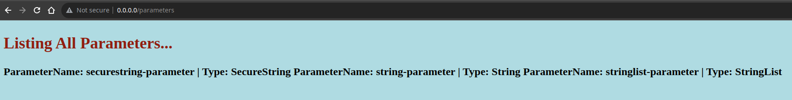
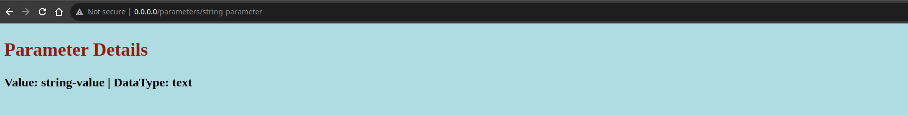
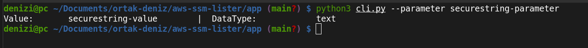

# aws-ssm-lister

This project lists all SSM parameters and their contents in AWS.

### How to use?

- **Cloning repo**

1. Clone repo.
2. Build image as **_ssmimage_** in current directory.
3. Mount the AWS credentials folder as a volume with **_-v_** and run on port 80.

``` bash
git clone https://github.com/deniz-icin/aws-ssm-lister.git
docker build -t ssmimage .
docker run --rm -ti -v ~/.aws:/root/.aws -p 80:80 ssmimage
```

-----------------------------------------------------------------------------------------------------

- **Use image from Dockerhub**

1. Run image as **_hariboidevops/ssmimage:latest_** in current directory.

``` bash
docker run --rm -ti -v ~/.aws:/root/.aws -p 80:80 hariboidevops/ssmimage:latest
```
> `docker run` command will automatically pull image from Dockerhub.

> :warning: If you want to list all parameters, go to *http://0.0.0.0:80/parameters*



> :warning: For parameter details, go to *http://0.0.0.0:80/parameters/$PARATEMER_NAME*



--------------------------

This project also include argparse module using python. It provides easy and user-friendly command-line interface.<br />
Run `python3 cli.py --parameter [PARAMETER_NAME]`. It returns the details for the given parameter.


